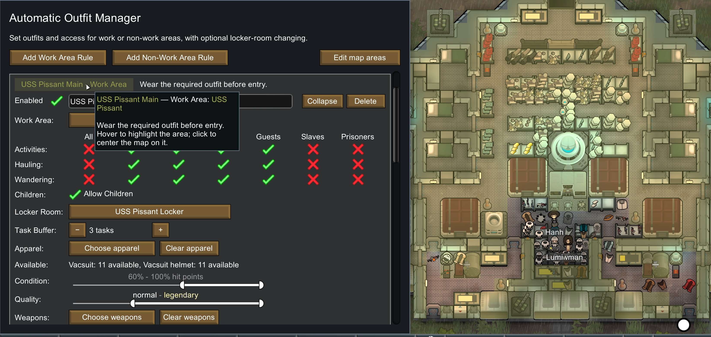
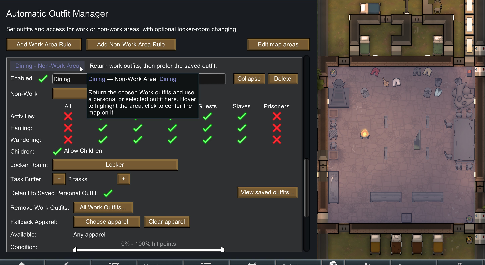
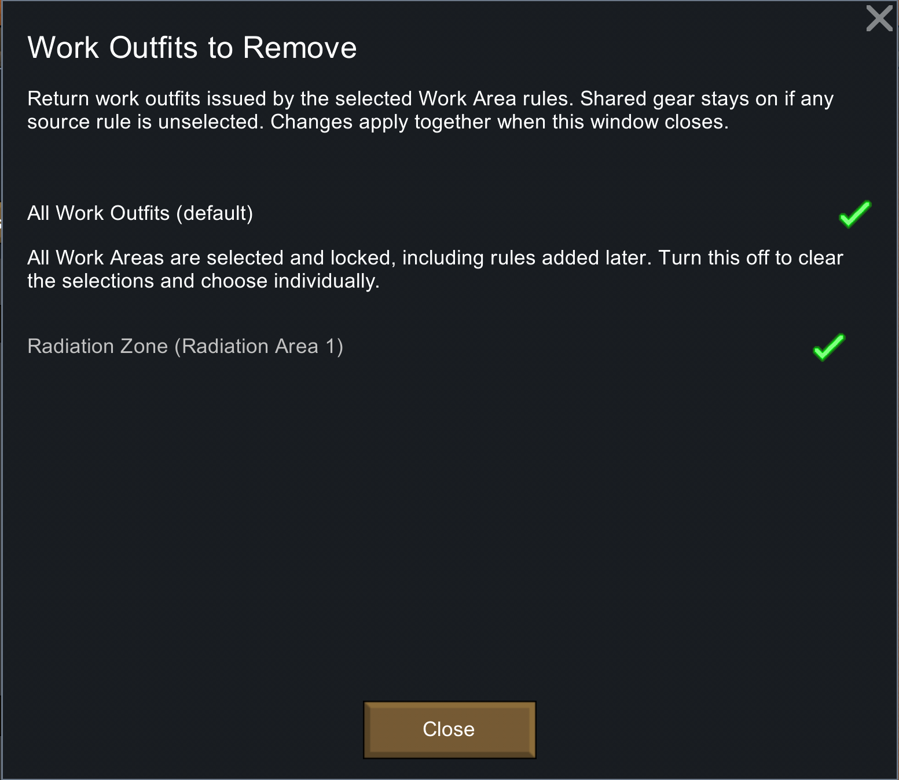
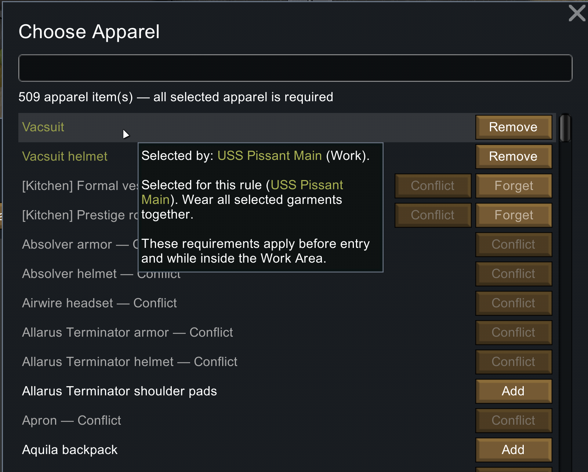
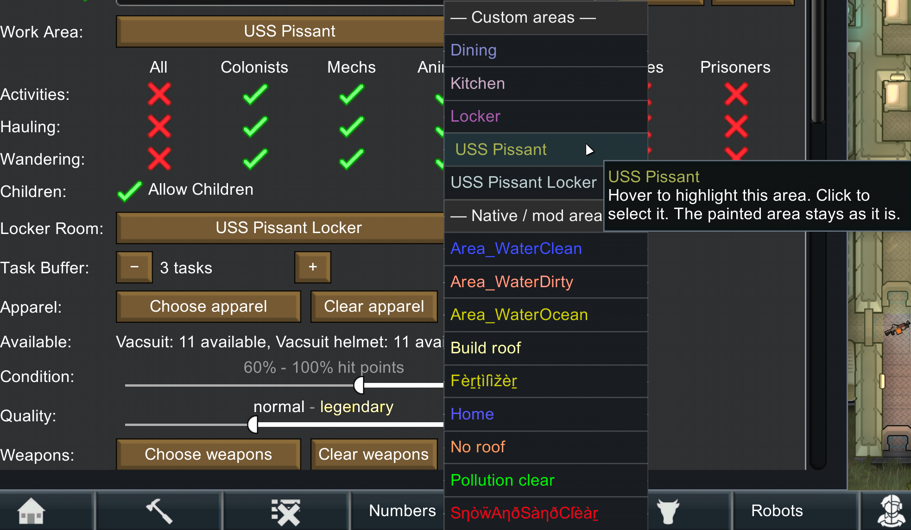
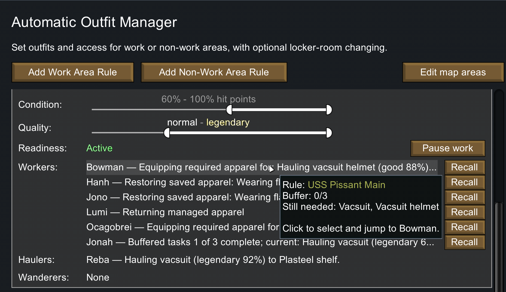
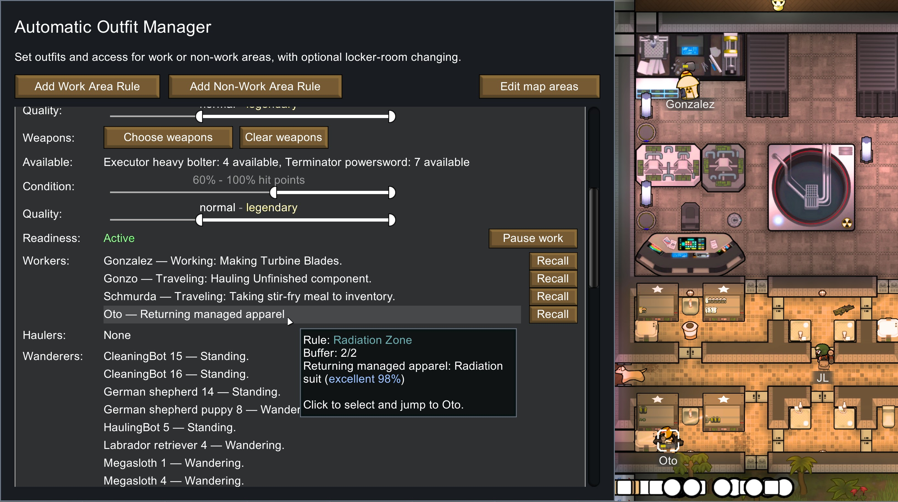
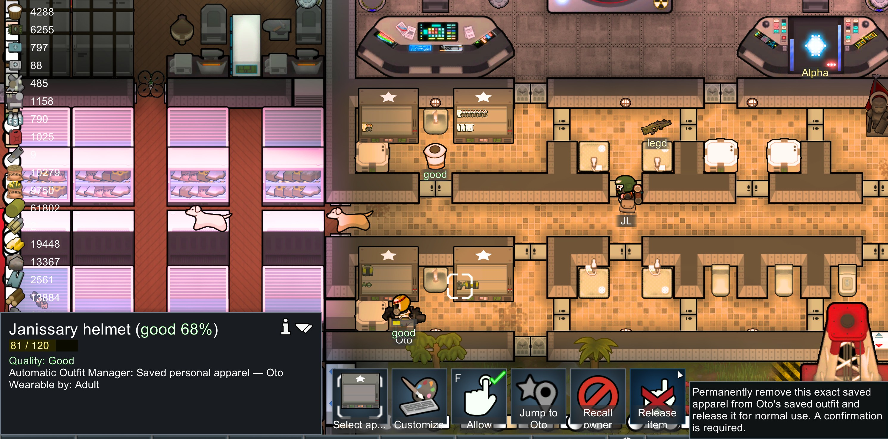

# 0.4.0 replacement screenshot gallery

Eight new screenshots supplied by the maintainer are saved below at their original resolution and encoding. No cropping, resizing, recompression or visual editing was applied. The published Workshop order starts with Work and Non-Work setup, then shows the supporting controls and pawn status.

**Release direction: replace all previous gameplay screenshots on GitHub and Workshop with this set. Do not append these to the older gallery.** Workshop replacement is complete: exactly these eight images are live in order. This release uses the same eight-image gallery on GitHub; previous active gallery files are retired from this branch and preserved in Git history and a local release backup. The branded About preview and application icons are separate assets.

| Order | Screenshot | Caption | Resolution |
|---|---|---|---|
| 1 | [Work Area setup](0.4.0/01-work-area.jpg) | Set required outfits, access permissions, a locker room and a task buffer for a Work Area. Rule colors match the painted area. | 3290×1563 |
| 2 | [Non-Work Area setup](0.4.0/02-non-work-area.jpg) | Use a Non-Work Area to return Work outfits and prefer saved personal clothing, with optional fallback selections. | 2892×1581 |
| 3 | [Choose which Work outfits to return](0.4.0/03-remove-work-outfits.png) | All Work Outfits is selected by default. Turn it off to choose individual source rules; shared items stay on if any source is unselected. | 1553×1348 |
| 4 | [Colored selections and conflicts](0.4.0/04-apparel-selections.png) | Apparel selections name their source rules and use map-area colors. Muted grey entries identify outfit conflicts. | 1602×1287 |
| 5 | [Find your custom areas first](0.4.0/05-grouped-map-areas.png) | Editable custom areas appear above special game and mod areas, with colored names and map highlighting. | 1966×1146 |
| 6 | [Follow outfit preparation](0.4.0/06-outfit-preparation.png) | See which apparel a pawn still needs, their completed buffer count, and separate hauling activity. | 1858×1073 |
| 7 | [Track work, returns and wandering](0.4.0/07-activity-and-return.jpg) | Compact hovers show the rule, completed buffer count and current outfit step. Animal and robot activity appears separately from humanlike workers. | 2775×1552 |
| 8 | [Saved personal item ownership](0.4.0/08-saved-item-ownership.jpg) | Inspect a saved garment to see its owner, jump to the pawn, recall them or release the saved item with confirmation. | 2982×1475 |

[Asset manifest](0.4.0/manifest.json) records original filenames, gallery order, dimensions and SHA-256 values. The original ShareX captures remain untouched. Gallery images are separate from the runtime package allowlist; their shapes do not need to match the 16:9 branded cover.

## Workshop image limits

Steam documents a limit of **under 1 MB per additional preview image**, with JPG and PNG among its suggested formats. [Steamworks: AddItemPreviewFile](https://partner.steamgames.com/doc/api/ISteamUGC#AddItemPreviewFile).

All eight originals pass a conservative **under 1,000,000 bytes each** check without resizing or recompression. The largest is `08-saved-item-ownership.jpg` at **938,376 bytes**; the entire set is **4,745,852 bytes**. The existing branded cover is **369,895 bytes**, with the project's required 16:9 shape. Keep gallery images at their original aspect ratios; the cover's 16:9 check is separate from gallery limits.

Before uploading, recheck actual file sizes and the active Workshop uploader's format, size and rendering constraints. If an export changes, keep the original and prepare a separate compliant upload copy. Do not crop away tooltip text or force these detailed gallery captures into the cover's shape. [The asset manifest](0.4.0/manifest.json) records this check. Steam accepted all eight originals; public preview identities and order were verified. See [Workshop closeout](../Tests/WORKSHOP-CLOSEOUT-0.4.0.md).

## Publication checklist

- [x] Receive and visually review all eight supplied images; preserve and hash-verify exact copies.
- [x] Prepare descriptive filenames, captions and a gallery order.
- [x] Verify all eight files are below 1,000,000 bytes; preserve their original encoding and aspect ratios.
- [x] Upload all eight compliant originals successfully; no resizing or recompression needed.
- [x] Replace every existing Workshop gameplay screenshot with these eight in the listed order; confirm the old gallery entries are gone.
- [x] Update the GitHub guide/gallery in this release to these eight images and retire the nine previous active gallery files, preserving history and a local backup.
- [x] Verify Workshop image identities and ordering. The table captions remain local descriptive copy; individual public caption text is not certified.
- [x] Verify the published GitHub gallery: all eight images load in order at their original dimensions, with the documented captions; nine previous active gallery files are retired. See [GitHub closeout](../Tests/GITHUB-CLOSEOUT-0.4.0.md).

The screenshots show portions of the new interface. They do not by themselves certify save/load continuity, Delete confirmation, completed recovery jobs or measured performance. Those checks remain in the [release checklist](../RELEASE-CHECKLIST.md). The current set shows All Work Outfits enabled, not a selective-removal example; it shows conflicts and source names, but no [Retained] row. Captions deliberately describe what is visible.

## Retired gallery

All older gameplay images are superseded. These nine files are removed from the active release gallery and remain available in earlier Git history:

- `Screenshots/AOM_Gravship_01.png`
- `Screenshots/AOM_Gravship_02.png`
- `Screenshots/AOM_Radiation_01.png`
- `Screenshots/AOM_Radiation_02.png`
- `Screenshots/AOM_Radiation_03.png`
- `Screenshots/AOM_Radiation_04.png`
- `Screenshots/AOM_Radiation_05.png`
- `Screenshots/AOM_Radiation_06.png`
- `Screenshots/AOM_Radiation_07.png`

## New gallery

### 1. Work Area setup

Set required outfits, access permissions, a locker room and a task buffer for a Work Area. Rule colors match the painted area.

### 2. Non-Work Area setup

Use a Non-Work Area to return Work outfits and prefer saved personal clothing, with optional fallback selections.

### 3. Choose which Work outfits to return

All Work Outfits is selected by default. Turn it off to choose individual source rules; shared items stay on if any source is unselected.

### 4. Colored selections and conflicts

Apparel selections name their source rules and use map-area colors. Muted grey entries identify outfit conflicts.

### 5. Find your custom areas first

Editable custom areas appear above special game and mod areas, with colored names and map highlighting.

### 6. Follow outfit preparation

See which apparel a pawn still needs, their completed buffer count, and separate hauling activity.

### 7. Track work, returns and wandering

Compact hovers show the rule, completed buffer count and current outfit step. Animal and robot activity appears separately from humanlike workers.

### 8. Saved personal item ownership

Inspect a saved garment to see its owner, jump to the pawn, recall them or release the saved item with confirmation.

